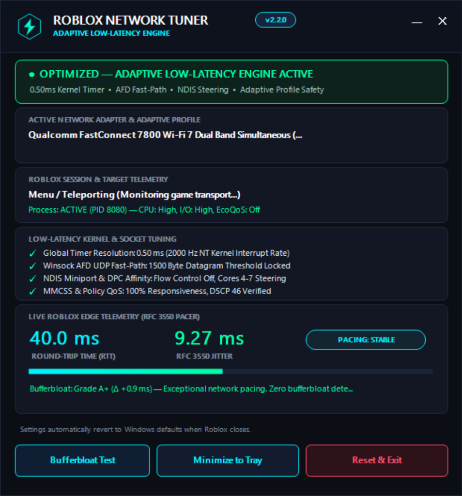

# Roblox Network Tuner

A lightweight Windows tool designed to eliminate random ping spikes, jitter, and input delay in Roblox. Runs automatically in the background while you play and restores all default Windows settings the second Roblox closes.

<p align="center">
  
</p>

---

## Why Does Roblox Lag On Windows?

Even with high-speed internet, Roblox players frequently deal with random rubberbanding, ping spikes, and delayed hits. Most of the time, the culprit isn't your internet speed—it's how Windows handles background tasks by default:

* **Background Wi-Fi Scans**: Every 60 seconds, Windows secretly scans for nearby Wi-Fi networks in the background. While your network card is scanning, game traffic freezes for 100–300ms, causing sudden ping spikes and rubberbanding.
* **Sluggish System Timer**: Windows defaults to a slow 15.6ms system timer (64 Hz), meaning game network packets sit waiting in queues before Windows wakes up to process them.
* **Windows 11 CPU Throttling (EcoQoS)**: Windows often decides Roblox is using too much power and shoves it onto low-power efficiency cores (E-cores), causing sudden stuttering and frame drops.
* **Socket Buffering**: Windows network buffers hold onto UDP packets briefly to batch them instead of sending them out the instant Roblox fires them.

Roblox Network Tuner temporarily tunes these settings while you play, and restores everything back to default the moment you close the game or exit the app.

---

## Features

### 🎯 Real In-Game Server Ping & Jitter
Most ping utilities test latency against Google (`8.8.8.8`) or Cloudflare (`1.1.1.1`), which doesn't reflect your actual game. Roblox Network Tuner reads your live Roblox game session directly from client transport logs in real time. It finds the exact game server IP and port you're playing on and displays your genuine in-game ping and RFC 3550 jitter.

### 📶 Wi-Fi Lag Spike Killer
Automatically pauses Windows background Wi-Fi scanning while in a match to stop periodic ping spikes.
* **Built-in safety**: If your Wi-Fi signal drops below 55% or -75 dBm, the scan pause is automatically disabled so your laptop can freely switch access points without dropping connection.
* **Ethernet aware**: If you're on a wired connection, Wi-Fi tweaks are completely bypassed in favor of low-latency NDIS queue settings.

### ⏱️ 0.50ms Hardware Timer
Tightens the Windows interrupt timer from 15.6ms down to **0.50ms (2000 Hz)** globally. Packets and frame inputs process immediately with near-zero scheduling quantization.

### 🚀 UDP Fast Path (AFD Datagram Thresholds)
Locks Winsock datagram buffers to route packets up to MTU size directly onto the kernel fast I/O path. Eliminates socket queuing delays during chaotic combat and heavy physics replication.

### ⚡ No CPU or Power Throttling
Automatically boosts Roblox's CPU priority to High, sets I/O priority to High, and explicitly disables Windows 11 EcoQoS (Efficiency Mode) to keep the game running on performance cores.

### 📊 Built-in Bufferbloat Diagnostic
Click **[Bufferbloat Test]** in the app or run `--bufferbloat` in terminal. It runs a controlled 5MB network burst to test your ping under load versus idle. If your latency spikes by more than 30ms under load, it diagnoses router queuebloat and gives you straightforward advice on router Smart Queue Management (SQM / CAKE) rather than claiming PC tweaks can fix a crowded home router.

### 🛡️ 100% Safe & Reversible
* Every change is backed up to a local snapshot before anything is applied.
* As soon as Roblox exits or you click **[Reset & Exit]**, all registry keys, services, and timers automatically revert to stock Windows defaults.
* Even if your PC crashes or loses power, the tuner detects the previous session on next launch and cleans everything up automatically.

---

## Downloads & Installation

Get the latest release from the **[Releases Page](https://github.com/getsentrix/RBLX-Network-Tuner/releases/latest)**:

| File | Type | Description |
| :--- | :--- | :--- |
| **`RobloxNetworkTunerSetup.exe`** | Installer | One-click setup. Creates Start Menu and Desktop shortcuts, adds clean uninstaller. |
| **`RobloxNetworkTuner.exe`** | Portable | Standalone executable. No installation needed, runs directly as administrator. |

---

## How to Use

1. Launch **Roblox Network Tuner** (run as Administrator when prompted so it can adjust network timers and socket parameters).
2. The dashboard will show your active adapter and wait for Roblox.
3. Open Roblox and join any experience. The dashboard will automatically latch onto the live game server and start displaying real-time ping and jitter.
4. When you're done playing, simply close Roblox or click **[Reset & Exit]**. Everything automatically resets to Windows defaults.

You can also click **[Minimize to Tray]** to keep it running unobtrusively in your system tray while gaming.

---

## False Positives & Antivirus Notice

When scanning `RobloxNetworkTunerSetup.exe` on VirusTotal, 1–2 automated engines (such as McAfee Scanner with a signature like `Ti!62A3A5E62541`) may flag it.

**Why does this happen?**
* The prefix **`Ti!`** in McAfee stands for **Threat Intelligence**—an automated cloud AI heuristic rule rather than an actual virus detection.
* Because the setup bootstrapper is a newly released, unsigned executable that embeds and extracts another executable (`RobloxNetworkTuner.pkg` compressed payload) into Program Files, heuristic scanners flag it as a generic dropper.
* **The entire project is 100% open source**: every line of C# source code is available right here in the repository for review. There are no obfuscators, packers, or hidden binaries.
* **Prefer zero-install?** If your antivirus complains about the installer, simply download the standalone **`RobloxNetworkTuner.exe`** instead. It does not extract any embedded payload and runs straight out of whichever folder you place it in.

---

## Command Line Options

For headless setups, batch scripts, or power users:

```cmd
# Dashboard & Diagnostics
RobloxNetworkTuner.exe                   Launch graphical dashboard (default)
RobloxNetworkTuner.exe --status          Display current network, adapter, and session state
RobloxNetworkTuner.exe --bufferbloat     Run loaded vs. idle bufferbloat diagnostic
RobloxNetworkTuner.exe --benchmark       Run RFC 3550 latency and jitter diagnostic
RobloxNetworkTuner.exe --check-update    Check GitHub for newer releases without modifying files
RobloxNetworkTuner.exe --update          Automatically download and apply latest release in-place
RobloxNetworkTuner.exe --verify-restore  Audit all settings against stock Windows defaults
RobloxNetworkTuner.exe --restore         Manually restore default Windows network settings
RobloxNetworkTuner.exe --help            Display help screen

# Silent Setup Options
RobloxNetworkTunerSetup.exe -s           Silent unattended installation
RobloxNetworkTunerSetup.exe -u           Uninstall and restore default network settings
```

---

<details>
<summary><b>🔧 Technical Reference (Under the Hood)</b></summary>

For systems engineers and curious players, here are the exact parameters modified during an active gaming session:

* **Winsock AFD**: `HKLM\SYSTEM\CurrentControlSet\Services\AFD\Parameters`
  * `FastSendDatagramThreshold` = 1500
  * `FastCopyReceiveThreshold` = 1500
  * `DoNotDisableReceiveBuffering` = 1
  * `DoNotDisableSendBuffering` = 1
  * `NonBlockingSendLimits` = 16
* **Kernel Timers**: `ntdll.dll!NtSetTimerResolution(5000, true)` & `winmm.dll!timeBeginPeriod(1)`
  * `HKLM\SYSTEM\CurrentControlSet\Control\Session Manager\kernel\GlobalTimerResolutionRequests` = 1
* **Process Priority**: `SetPriorityClass` to `HIGH_PRIORITY_CLASS`, `NtSetInformationProcess` for `IoPriorityHigh`, `SetProcessInformation` disabling `PROCESS_POWER_THROTTLING_EXECUTION_SPEED`.
* **TCP/IP Interface (Active GUID only)**:
  * `TcpAckFrequency` = 1, `TCPNoDelay` = 1, `TcpDelAckTicks` = 0
* **QoS Expedited Forwarding**: Policy-based DSCP 46 tagged specifically on `RobloxPlayerBeta.exe`. Tested and validated for packet loss on connection; auto-reverted if ISP deprioritizes non-zero DSCP tags.
* **MMCSS Profile**: `HKLM\SOFTWARE\Microsoft\Windows NT\CurrentVersion\Multimedia\SystemProfile`
  * `NetworkThrottlingIndex` = 0xFFFFFFFF, `SystemResponsiveness` = 0

All keys are stored in `tuner_state.json` and reverted symmetrically upon session termination.
</details>

---

## Building from Source

To compile the binaries yourself using Windows built-in .NET Framework compiler (`csc.exe`):

```powershell
powershell -NoProfile -ExecutionPolicy Bypass -File .\build_installer.ps1 -SkipSigning
```

Compiled binaries will be generated in `release\`:
* `release\RobloxNetworkTuner.exe`
* `release\RobloxNetworkTunerSetup.exe`
* `release\SHA256SUMS.txt`
